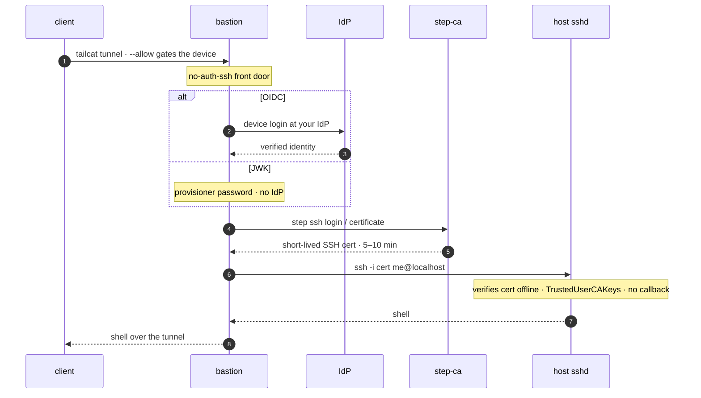

# catsflap — cert stack (OIDC / JWK)

The default stack. A login — an **OIDC identity** or a **JWK provisioner
password** — becomes a short-lived SSH **certificate** that a real `sshd` on the
target verifies offline. See the [project README](../README.md) for how catsflap
fits together and how this compares to the [pubkey stack](../pubkey/).

> **Just want to try it?** See [QUICKSTART.md](./QUICKSTART.md) — a one-command
self-contained stack you can run locally or on a VPS, no IdP required.

## Overview



1. Only an approved client key can reach the bastion, and only over the tunnel
   (no open ports, no IP needed).
2. The client authenticates with an OIDC provider or the JWK provisioner
   password. step-ca validates it and signs a certificate whose principal is the
   authorized identity.
3. The bastion uses the short-lived, identity-bound certificate to log in.
4. The **host sshd** trusts one CA public key (`TrustedUserCAKeys`), verifies the
   certificate with no callback, and logs the principal.

> [!WARNING]
> The bastion can obtain a certificate for whoever passes the configured login —
> an OIDC identity, or anyone holding the JWK provisioner password — so the
> security rests on that method (your IdP, or the secrecy of the password) and on
> `--allow` (which device may reach the bastion). Scope the step-ca provisioner to
> the right users, keep certificate lifetimes short, and treat the bastion as a
> trusted component.

## Dry run

The bastion runs the official `smallstep/step-cli` image (which already ships
`step` and a shell, and adds the ssh client with `apk` at start). The tailcat
binary comes straight from the official image: an init service mounts an empty
named volume over the image's `/usr/local/bin`, and Docker **seeds** the volume
with the binary it finds there.

The certificate core is proven end to end by [`verify.sh`](./verify.sh):

```sh
$ ./verify.sh
...
    OK whoami=demo
== PASS: cert-only login works ==
```

The **JWK** path needs nothing external (e.g. `step-ca`'s auto-created `admin`
provisioner plus a password) so `verify.sh` and the quickstart drive it end to
end.

> [!NOTE]
> The bastion is based on `step-cli` rather than the distroless tailcat image
> because an ssh client isn't a static drop-in the way a shell would be.

## Host setup (once)

Trust step-ca's SSH user CA on the host you want to reach. Put its user-CA
public key at `/etc/ssh/step_user_ca.pub` and add [`sshd-ca.conf`](./sshd-ca.conf)
to `/etc/ssh/sshd_config`, then reload sshd. Create a login account whose name
matches the certificate principals you'll issue (e.g. `alice`). That's the only
host-side change — no per-user keys, ever.

## step-ca provisioners

step-ca **auto-initializes** on the first `docker compose up` with the SSH CA
enabled (`DOCKER_STEPCA_INIT_SSH`) and a JWK provisioner named `admin` — so **JWK
mode works out of the box**, no `step ca init` by hand. To *also* offer OIDC, add
a provisioner pointing at your IdP once the stack is up — any OIDC provider with a
device-flow client works (`--ssh` sets `enableSSHCA`, which lets it sign SSH certs):

```sh
docker compose exec step-ca step ca provisioner add oidc --type OIDC --ssh \
  --client-id "<step-ca-client-id>" --client-secret "<secret>" \
  --configuration-endpoint "https://idp.example.com/.well-known/openid-configuration"
docker compose restart step-ca
```

## Bastion config and run

All configuration lives in a `.env` file (copy [`.env.example`](./.env.example)).
The bastion's entrypoint materializes these into the files the wrapper reads —
`no-auth-ssh` strips the session environment, so the wrapper can't read env vars
directly, but the container's startup can. Only four values are required; the
CA fingerprint is derived from the shared CA volume, not pinned by hand:

```sh
cp .env.example .env
# then edit:
#   ALLOW_KEY=nodekey:...   (client's pubkey; tailcat genkey --client --key=client-default)
#   CA_PASSWORD=...         (initializes + unlocks step-ca; also the JWK prompt answer)
#   TARGET=alice@localhost  (user@host; the client can override the user)
#   DEFAULT_METHOD=jwk      (jwk works out of the box; oidc needs a provisioner — override per-connection with --oidc/--jwk)
docker compose up -d
```

A connection now carries a login and lands on the host with a fresh certificate:

```sh
client$ tailcat ssh <addr>
# OIDC:  prints a sign-in URL (open it, approve in the browser)
# JWK:   prompts for the provisioner password instead — no browser, no IdP
# either way a ~10-minute cert is minted and sshd logs you in as the principal
```
