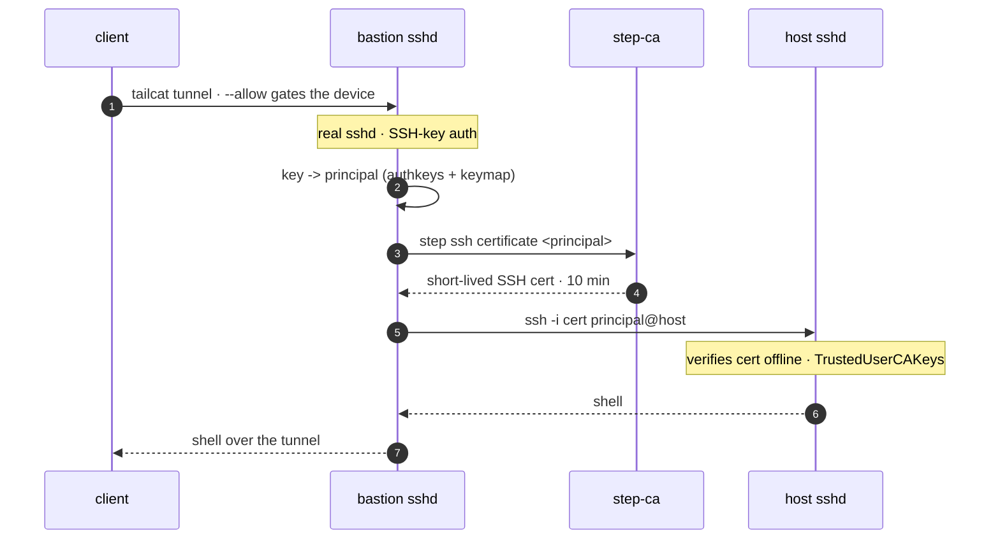

# catsflap — pubkey stack (SSH keys)

Per-user identity with **no IdP and no shared secret**: a client authenticates to
the bastion with an ordinary **SSH key** on an allowlist, and the bastion mints a
short-lived certificate for the principal that key maps to, then logs in to the
target's real `sshd`. The client never holds the CA password — its key is the
whole credential. See the [project README](../README.md) for how this compares to
the [cert stack](../cert/).

> **Just want to try it?** See [QUICKSTART.md](./QUICKSTART.md) — prove the whole
key → cert → sshd path locally with [`verify-pubkey.sh`](./verify-pubkey.sh),
then deploy against your host.

## Overview



1. `--allow` gates which device may reach the bastion (transport layer, by
   tailcat node key).
2. The bastion's **real `sshd`** authenticates the client's **SSH key**. An
   `AuthorizedKeysCommand` ([`authkeys.sh`](./authkeys.sh)) looks the key up in
   [`keymap`](./keymap.example) and maps it to a principal — the mapping, not the login
   name, is the identity.
3. A forced command ([`mint-and-proxy.sh`](./mint-and-proxy.sh)) mints a
   short-lived cert for that principal (step-ca's JWK `admin` provisioner; the CA
   password stays server-side) and logs in to the target host as the principal.
4. The **host `sshd`** trusts one CA public key (`TrustedUserCAKeys`) and verifies
   the certificate offline.

> [!WARNING]
> Anyone whose key is in `keymap` can become the principal it maps to, and the
> bastion holds the CA password. Guard the keymap and the `--allow` list, keep
> cert lifetimes short, and treat the bastion as trusted. A client's SSH private
> key is a standing credential — but it lives on the client, never on the target.

## Why a key instead of OIDC or JWK

It's the middle ground between the [cert stack](../cert/)'s two methods:

- vs **JWK** (a shared password, everyone the same): keys are **per-user**,
  non-shared, and individually revocable — real identity and audit.
- vs **OIDC** (per-user, but needs a live IdP): **nothing external** — just the
  key you already have. Great for a homelab or small team that lives in SSH keys.

And it's multi-host-native: one `keymap` at the bastion → a principal → a cert
valid on every host that trusts the CA.

## Dry run

[`verify-pubkey.sh`](./verify-pubkey.sh) runs the real `authkeys.sh` and
`mint-and-proxy.sh` end to end (no tailcat, all local Docker): a listed key lands
as its principal on a target sshd that trusts only the CA, and an unlisted key is
refused.

```sh
$ ./verify-pubkey.sh
...
    OK whoami=demo
    catsflap@bastion: Permission denied (publickey,keyboard-interactive).
== PASS: SSH key -> principal -> cert -> real sshd; unlisted key refused ==
```

## Host setup (once)

Same as the cert stack: trust step-ca's SSH user CA on the target. Put its user
CA public key at `/etc/ssh/step_user_ca.pub`, add [`sshd-ca.conf`](./sshd-ca.conf)
to `/etc/ssh/sshd_config`, reload sshd, and make sure a login account exists for
each principal you'll issue.

## Config and run

1. `cp .env.example .env` and set `ALLOW_KEY`, `CA_PASSWORD`, and `TARGET_HOST`
   (see [`.env.example`](./.env.example)).
2. `cp keymap.example keymap` and add your users' public keys, one per line —
   `<principal> <keytype> <key-base64>`.
3. `docker compose up -d` — step-ca auto-initializes; the bastion brings up its
   sshd front door and serves it over tailcat.
4. Trust the CA on the host (above).
5. Connect with your own SSH key; you land on the target as the mapped principal:
   ```sh
   tailcat ssh catsflap@<addr>            # interactive
   tailcat ssh catsflap@<addr> uptime     # run a command
   ```

> [!NOTE]
> Clients log in to the bastion as the fixed account `catsflap` — identity comes
> from the key, not this name — so connect as `catsflap@<addr>`. Edit `keymap`
> and `docker compose up -d` to add or remove people.
